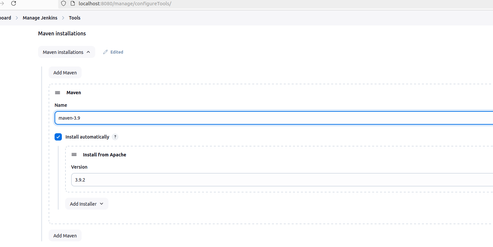
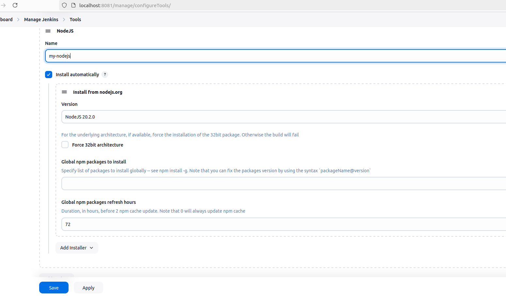
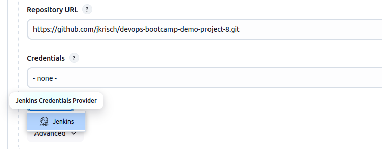

# Demo Projects - Build Automation & CI/CD with Jenkins

## Create a CI Pipeline with Jenkinsfile
1. Install Build Tools in Jenkins
    * Install maven 
        * build tool for java apps
        * run tests and build jar file with maven
    * Install npm
        * Build tool for node apps
        * run tests, package and push to repos 
    * 2 ways to install:
        * install plugin via UI  
          For maven: 
           
          For nodejs: 
          
        * install tools directly on server (or inside container if jenkins runs within a container)  
          Or (as I did it) you build a new Jenkinsfile and install it during the build process: [See](./Dockerfile_Jenkins_Container).  
          By doing this we can persist the npm tool within the container (as if we would do it on the cli within the container we will loose it once we run another jenkins container)
          This varian (installing it directly on the host) is much more flexible

2. Connect to Git repo
  * Add Git Repo URL to Source Code Management in Freestyle Project  
  
  * I did not add credentials as it is a public repo - In case of a private repo credentials would be required
  