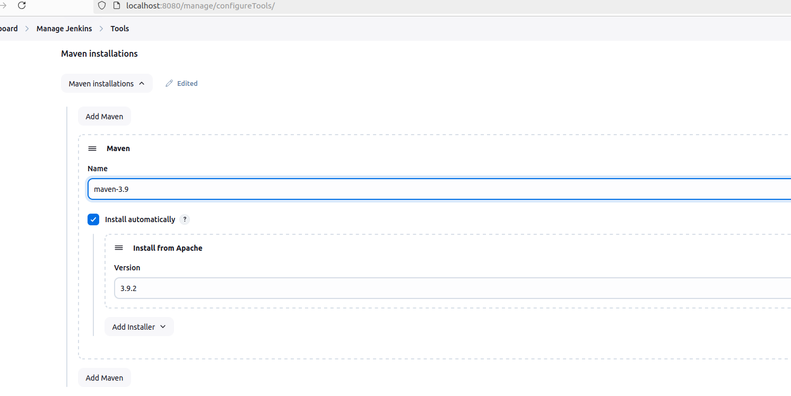
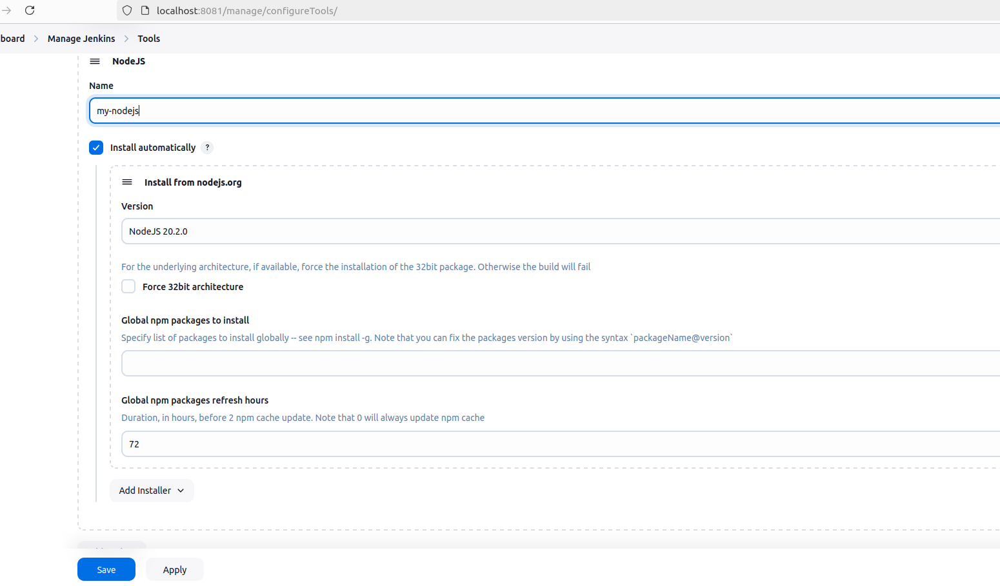
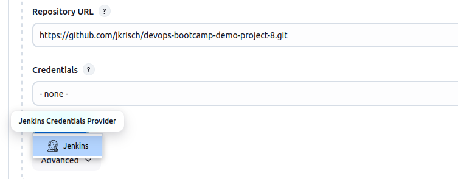

# Demo Projects - Build Automation & CI/CD with Jenkins

## Create a CI Pipeline with Jenkinsfile
### 1. Install Build Tools in Jenkins
  * Install maven 
      * build tool for java apps
      * run tests and build jar file with maven
  * Install npm
      * Build tool for node apps
      * run tests, package and push to repos 
  * 2 ways to install:
      * install plugin via UI <br>
        For maven:<br>
        <br>
        For nodejs:<br>
        
      * install tools directly on server (or inside container if jenkins runs within a container) <br>
        Or (as I did it) you build a new Jenkinsfile and install it during the build process: [See](./Dockerfile_Jenkins_Container). <br>
        By doing this we can persist the npm tool within the container (as if we would do it on the cli within the container we will loose it once we run another jenkins container)
        This varian (installing it directly on the host) is much more flexible

### 2. Connect to Git repo
* Add Git Repo URL to Source Code Management in Freestyle Project <br>

* I did not add credentials as it is a public repo - In case of a private repo credentials would be required

### 3. To install docker I installed it within the container build of my custom jenkins container: [Dockerfile](./Dockerfile_Jenkins_Container)
I also had to run the container as follows (where jenkins:lec-8 is the container in my local container registry)
```bash
docker run -d -v jenkinslec8_home:/var/jenkins_home -p 8081:8080 -p 50000:50000 -v /var/run/docker.sock:/var/run/docker.sock --restart=on-failure --name jenkins-controller-lec8 jenkins:lec-8
```

### 4. As it is a common practice to use one freestyle job for one job/step you would need to have many jobs, which keeps to become an unmaintainable task. <br>
   Another downside is you do not have the scripting options so you would need to configure it via UI.<br>
   Therefore the pipeline job type needs to be invoked.<br>
   The programming language for the pipeline scripts is groovy and is stored in so called jenkinsfiles.<br>
   See: [Jenkinsfile](./Jenkinsfile)

### 5. After building the complete pipeline the image can be found [here](https://hub.docker.com/repository/docker/jaykay84/java-demo-app/general)

### 6. 

   